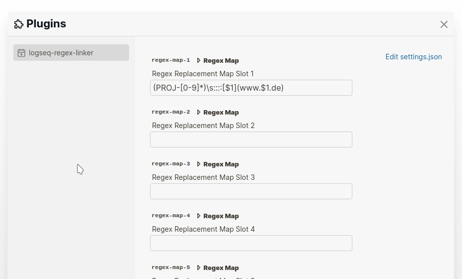

# Regex Linker

Text replacement via regex while typing.

Original inspiration was that i wanted to replace jira ticket ids with the links to that ticket. 
Eg if i type in "PROJ-1234", it will automatically create a link to
http://jira-cloud-whatever.com/id/PROJ-1234

Thanks to [datenlp plugin](https://github.com/hkgnp/logseq-datenlp-plugin) by [hkgnp](https://github.com/hkgnp) for inspiration on how to write this plugin

## Getting started

1. Download plugin
2. Go to Settings -> Plugin -> Regex Linker
3. Separate regex from replacement value via "::::" (4 colons)

       (PROJ-[0-9]*)\s::::[$1](http://cloud-jira-whatever.com/id/$1)