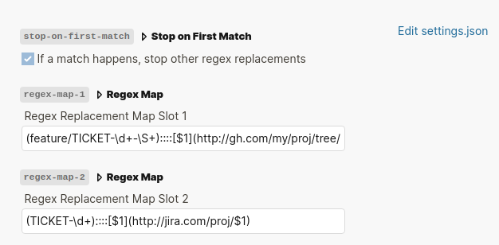

# Regex Linker V2

Text replacement via regex while typing.

Original inspiration was that i wanted to replace jira ticket ids with the links to that ticket. 
Eg if i type in "PROJ-1234", it will automatically create a link to
http://jira-cloud-whatever.com/id/PROJ-1234

Thanks to [datenlp plugin](https://github.com/hkgnp/logseq-datenlp-plugin) by [hkgnp](https://github.com/hkgnp) for inspiration on how to write this plugin

## Getting started

1. Download plugin
2. Go to Settings -> Plugin -> Regex Linker
3. Separate regex from replacement value via "::::" (4 colons)

## Cookbook

#### Match jira strings

       (PROJ-[0-9]*)::::[$1](http://cloud-jira-whatever.com/id/$1)

## V2.0.0 Regex matching

Thanks to [terminalImage](https://github.com/terminalmage) for an improved algorithm. See [here](https://github.com/AskMeAgain/logseq-regex-linker/issues/2) for more information

I changed the regex matching algorithm. If you notice any errors please tell me

## V2.1.0 Break on first match

This is an optional flag you can enable (at the top of the plugin settings). 
Useful if you have lots of pattern that can match each other.

